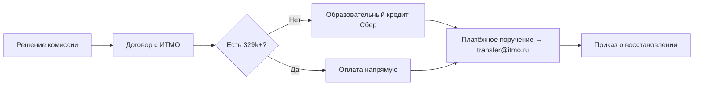

# Финансирование обучения

**Источники:**
- [student.itmo.ru/ru/contract](https://student.itmo.ru/ru/contract/)
- [abit.itmo.ru/page/crediting](https://abit.itmo.ru/page/crediting)

**Актуализировано:** 25.07.2026

---

## Стоимость

| Параметр | Значение |
|---|---|
| ОП | Компьютерные системы и технологии (09.03.01) |
| Стоимость (2026) | **599 000 ₽ / год** |
| Источник | [abit.itmo.ru/program/bachelor/computer_systems](https://abit.itmo.ru/program/bachelor/computer_systems) |

> Точная сумма фиксируется **приказом** на момент заключения договора. После подписания договора повышение цены допускается только с учётом инфляции.

### Расчёт первого платежа при восстановлении осенью

| Платёж | Доля | Сумма (~) |
|---|---|---|
| Осенний семестр | ≥ 55% годовой стоимости | **≥ 329 450 ₽** |
| Весенний семестр | оставшиеся 45% | **≤ 269 550 ₽** |

> При восстановлении/переводе в **весеннем** семестре также оплачивается ≥ 55% годовой стоимости.

---

## Порядок оплаты при восстановлении

1. Получить **положительное решение** комиссии
2. Заключить **договор** об образовании
3. Оплатить **как можно скорее** (без оплаты приказ не выпускают)
4. Отправить **чек или платёжное поручение** на **transfer@itmo.ru**
5. Принести **оригинал подписанного договора** в Студофис

### Способы оплаты

1. **Банк** — по реквизитам ИТМО (указать: семестр, учебный год, номер договора, ФИО)
2. **ИСУ / my.itmo.ru** → Административные сервисы → Финансы → Договоры (карта, СБП, Gazprom Pay)
3. **Квитанция** — заявка в my.itmo.ru → «Квитанция на оплату образовательных услуг»
4. **Образовательный кредит**
5. **Материнский капитал**

### Реквизиты (из student.itmo.ru)

```
Получатель: УФК по Нижегородской области (Университет ИТМО, л/с 30726Щ43860)
ИНН 7813045547, КПП 781301001
Казначейский счёт: 03214643000000013225
Единый к/с: 40102810745370000024
Банк: ОКЦ № 1 ВВГУ Банка России//УФК по Нижегородской области, г. Нижний Новгород
БИК 012202102
```

---

## Образовательный кредит с господдержкой

**Правовая база:** Постановление Правительства РФ № 1448 от 15.09.2020

### Условия (Сбербанк, через abit.itmo.ru)

| Параметр | Значение |
|---|---|
| Ставка для заёмщика | **3%** (государство компенсирует 18,44%) |
| На что | один семестр, год или весь срок обучения |
| Льготный период | весь срок обучения **+ 9 месяцев** — платишь **только проценты** |
| Погашение основного долга | до **15 лет** |
| Досрочное погашение | без комиссии |

### Где оформить

- В университете — у **банковского мобильного менеджера** Сбербанка
- Адрес приёмной комиссии: Кronverksky пр., 49, лит. А (вход со стороны Сытнинской ул.)

### Документы для заявки на кредит

| Документ | Примечание |
|---|---|
| Договор о платных образовательных услуг | подписанный представителем вуза |
| Паспорт | с отметкой о постоянной регистрации |
| Справка о временной регистрации | если живёшь не по прописке |
| Квитанция / счёт на оплату | с суммой за обучение |

### Если нет 18 лет

Дополнительно: анкеты законных представителей, письменное согласие родителя, свидетельство о рождении, паспорт родителя в офисе банка.

### Важные нюансы

- **Заказчик по договору = студент** (ты сам)
- Кредит оформляется **после** положительного решения и **подписания договора** с вузом
- **Поручение банка** (до фактического перевода) **не принимается** бухгалтерией как подтверждение оплаты — нужно **платёжное поручение**
- Другие банки тоже могут выдавать образовательные кредиты — условия уточнять в отделении

### Примерная оценка платежей (599 000 ₽/год, ставка 3%)

| Период | Что платишь | Примерно |
|---|---|---|
| Льготный (учёба + 9 мес.) | Только проценты (~3% годовых от суммы) | ~1 500 ₽/мес. на 329 450 ₽ первого платежа |
| После льготного | Основной долг + проценты | рассчитывается индивидуально, до 15 лет |

> Это грубая оценка. Точные цифры — в калькуляторе Сбербанка или у менеджера.

---

## Материнский капитал

- Заказчик по договору — **владелец сертификата**
- Обучающемуся на дату начала обучения — **не старше 25 лет**
- Сумма из маткапитала **не должна превышать** стоимость семестра
- Подача через СФР / Госуслуги / МФЦ
- Срок решения: 5 рабочих дней (до 12 в отдельных случаях)
- Перечисление: 5 рабочих дней после одобрения

---

## Налоговый вычет

- При оплате из **собственных средств** (не маткапитал) можно вернуть 13% НДФЛ
- Нужен официальный доход и статус налогоплательщика РФ
- Справку заказываешь через Студофис (so@itmo.ru) после оплаты

---

## Риски при просрочке оплаты

- Договор может быть расторгнут → отчисление
- При отчислении за неуспеваемость **деньги за текущий семестр не возвращаются** (кроме оплаты из маткапитала)

---

## Рекомендуемая стратегия



### Действия заранее (до августа)

- [ ] Проверить кредитную историю / одобряемость в Сбербанке
- [ ] Уточнить в Студофисе (transfer@itmo.ru), можно ли начать сбор документов для кредита параллельно с подачей
- [ ] Рассчитать: оплата первого семестра (~330k) + возможные расходы на переезд/проживание
