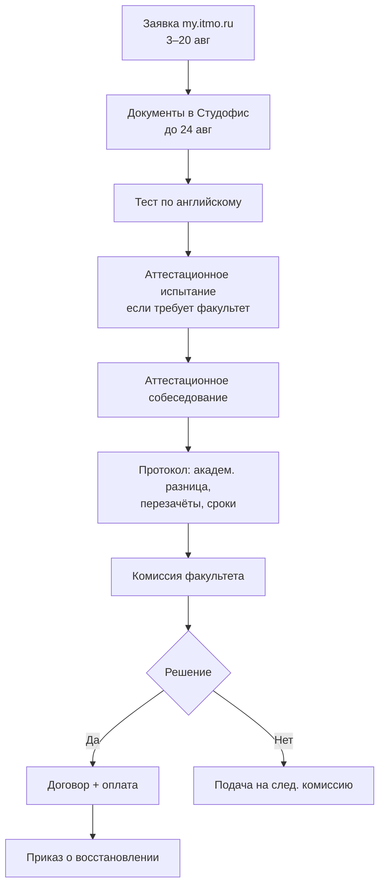

# Восстановление в ИТМО — справочник

**Источник:** [student.itmo.ru/ru/rehabilitation_new](https://student.itmo.ru/ru/rehabilitation_new/)  
**Актуализировано:** 25.07.2026

---

## Когда проходят комиссии

Комиссии по восстановлениям работают **два раза в год**:

- **Август** (летняя сессия) — основное окно
- **Январь–февраль** (зимняя сессия) — запасное окно

### Лето 2026

| Этап | Срок |
|---|---|
| Подача заявления (my.itmo.ru) | **3 августа — 20 августа до 19:00** |
| Документы в Студофис (оригиналы) | **до 24 августа** |
| Публикация вакантных мест | конец августа (после окончания приёма) |
| Результаты комиссии | **начало сентября** |

> Подача заявлений **вне сроков невозможна**.

---

## Твой случай: отчисление за неуспеваемость

| Термин | Значение |
|---|---|
| **Неуважительная причина** | Отчисление по инициативе университета (неуспеваемость, нарушение договора) |
| **Уважительная причина** | Отчисление по собственному желанию |

**Следствие:** восстановление **только на платное** обучение. Бюджет недоступен.

---

## Условия восстановления на платное

- Могут претендовать и бывшие бюджетники, и бывшие платники
- В течение **5 лет** с даты отчисления
- Можно указать восстановление на **тот же курс** и/или **на один курс ниже**
- **Нельзя** восстановиться на 1 семестр 1 курса — только через приёмную комиссию
- Количество попыток **не ограничено**
- Можно подать до **5 заявлений** на разные ОП (если твоя программа не реализуется)

---

## Процедура (платное восстановление)

### Этапы подробно

1. **Заявка** — заполнить анкету в [личном кабинете](https://my.itmo.ru)
2. **Документы** — принести оригиналы в Студофис (или отправить по почту, если не в СПб)
3. **Тест по английскому** — обязателен для допуска к собеседованию; результат **не влияет** на решение о восстановлении; проходить **самостоятельно**
4. **Аттестационное испытание** — у некоторых факультетов (включая ФИТиП); проверяет уровень знаний
5. **Аттестационное собеседование** — обсуждение **академической разницы** с представителем факультета (онлайн: ПК, камера, интернет)
6. **Протокол** — фиксирует: академическую разницу, перечень перезачётов и переаттестаций, **срок ликвидации**
7. **Комиссия факультета** — рассматривает документы
8. **Решение** — уведомление в my.itmo.ru в начале сентября

> Уведомление о собеседовании может прийти **за день до** проведения.

---

## Академическая разница

- Считается **факультетом**, куда восстанавливаешься
- Протокол выдаётся на аттестационном собеседовании
- Ликвидация — **индивидуально с назначенным преподавателем**
- Сроки устанавливает **факультет**

### Что это значит для тебя

После восстановления, скорее всего, нужно будет:

1. Закрыть **несданные предметы** (ВМ, ТПВ, физкультура) — через переаттестацию / комиссии
2. Ликвидировать **академическую разницу** — предметы, которые ты не проходил, пока был отчислён (если восстановишься на 3 курс)

---

## Документы для подачи

| Документ | Примечание |
|---|---|
| Заявление | из заявки my.itmo.ru |
| Анкета | из заявки |
| Согласие на обработку ПДн | из заявки |
| 2 фото 3×4 | |
| Копия паспорта | разворот с фото + прописка |
| Копия СНИЛС | для граждан РФ |
| Оригинал документа об образовании | с приложением (аттестат) |

### Алгоритм подачи

1. Заполнить анкету в my.itmo.ru → заявка «Восстановление в число обучающихся после отчисления»
2. После согласования заявки — принести документы в Студофис **до 24 августа**
3. Запись на испытание/собеседование — через заявку, уведомление на my.itmo.ru

### Если не в Санкт-Петербурге

1. После проверки заявки — распечатать заявление, анкету, согласие на ОПД, подписать
2. Отправить сканы на **transfer@itmo.ru**
3. Оригиналы — по адресу из ответного письма

---

## После положительного решения

1. Заключить **договор** об образовании
2. **Оплатить** обучение (чем быстрее, тем лучше)
3. Направить подтверждение оплаты на **transfer@itmo.ru**
4. Принести **оригинал договора** в Студофис
5. Выпускается **приказ о восстановлении**

> Без подтверждения оплаты и подписанного договора приказ **не выпускают**.

---

## Аттестационные испытания на факультетах

На странице восстановления опубликованы планы испытаний для:

- Институт дизайна и урбанистики
- НОЦ инфохимии
- Факультет биотехнологий
- **Факультет информационных технологий и программирования (ФИТиП)**

> **Внимание:** твоя ОП «Компьютерные системы и технологии» числится на **ФПИиКТ**. Уточни в Студофисе / у факультета, какое подразделение проводит собеседование и есть ли отдельное испытание для ФПИиКТ. Возможно, ФИТиП и ФПИиКТ объединены или переименованы.

---

## ППА (повторная промежуточная аттестация)

Если после восстановления останутся академические задолженности:

| Период | Срок (2025/26, весна) | Суть |
|---|---|---|
| ППА1 | 1–21 сентября | Сдача у преподавателя + комиссии |
| ППА2 | 22 сентября – 5 октября | Только комиссии; после — отчисление при незакрытии |

Источник: [student.itmo.ru/ru/repeat_interim_exams](https://student.itmo.ru/ru/repeat_interim_exams/)

---

## FAQ (кратко)

| Вопрос | Ответ |
|---|---|
| Когда узнаю вакантные места? | Конец августа |
| Можно ли на бюджет? | Нет, при отчислении за неуспеваемость |
| Сколько попыток? | Неограниченно за 5 лет |
| Влияет ли тест по английскому? | Нет, на решение о восстановлении |
| Что если ОП закрыта? | Подать на другую (до 5 заявлений) |
