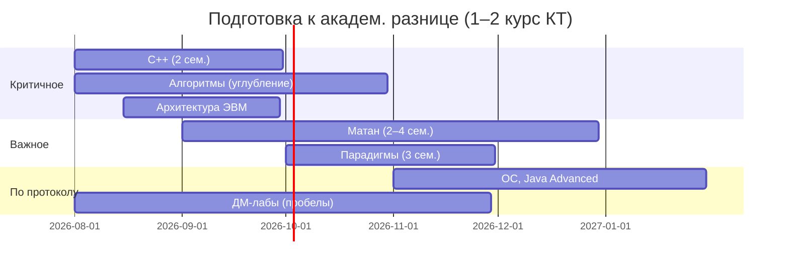

# Академическая разница: подготовка по 1–2 курсу КТ

**Сохранено:** 05.08.2026  
**Цель:** собрать ресурсы для самостоятельной подготовки к ликвидации академической разницы при восстановлении на КТ (вероятно, 3 курс → нужны предметы 1–2 курса КТ, которых не было в программе «Компьютерные системы и технологии»).

> Материалы ниже — для **подготовки и понимания программы**. Сдавать чужие работы как свои нельзя (плагиат → отчисление).

---

## Сравнение: что уже есть vs что нужно на КТ

| Предмет КТ (1–2 курс) | Статус в зачётке (КСиТ) | Комментарий |
|---|---|---|
| Введение в программирование | ✅ Программирование (1–2 сем.) | Похожий курс (Java, Корнеев), можно не пересдавать |
| C++ | ❌ не проходил | **Новый** — приоритет |
| Парадигмы программирования | ❌ не проходил | **Новый** — приоритет |
| Технологии программирования (Java Advanced) | ⚠️ частично (ЯП, 3 сем.) | Нужно уточнить перезачёт |
| Архитектура ЭВМ | ⚠️ Архитектура компьютера (43 балла) | Слабо сдан → переаттестация |
| ОС | ❌ не проходил | 3 сем. КТ |
| Дискретная математика | ✅ ДМ продв. (1–2 сем.) | Высокий балл; возможен перезачёт с разницей в лабах |
| Алгоритмы и структуры данных | ⚠️ 60 баллов (4 сем.) | Слабо → подтянуть |
| Линейная алгебра | ✅ Линал продв. (1–2 сем.) | Вероятен перезачёт |
| Математический анализ | ⚠️ Математика продв. (3/E на 2 сем.) | Слабое место → подтянуть |
| Матлогика, Метопты, Теорвер | ⚠️ частично (4 сем.) | Метопты 28, теорвер зачёт 61 — на грани |
| Цифровая кulture | ❌ | Небольшой курс, 72 ч |
| Базы данных | ✅ 100 (2 сем.) | На КТ БД в 7 сем. — перезачёт маловероятен как разница |

**Итог по приоритетам подготовки:** C++, парадигмы, архитектура ЭВМ, алгоритмы, матан, затем ОС и Java Advanced.

---

## Архив кафедры КТ (старые годы)

### [egormkn/ifmo-kt](https://github.com/egormkn/ifmo-kt)

Практические задания кафедры КТ. Структура по курсам:

| Папка | Содержание |
|---|---|
| `course1/` | 1 курс: алгоритмы, C/C++, дискретная математика, архитектура ЭВМ, линал, матан, парадигмы, физика |
| `course2/` | 2 курс: C++, алгоритмы, дискретная математика, матлогика, матан, физика |
| `course3/` | 3 курс: функ. анализ, численные методы, теорвер |

Полезные подпапки в `course1/`: `algorithms/`, `cplusplus/`, `discrete_math/`, `computer_architecture/`, `linal/`, `matan/`, `paradigms/`.

**README репозитория** содержит прямые ссылки на материалы 1 курса:
- [Алгоритмы](https://github.com/egormkn/ifmo-kt/blob/master/course1/algorithms/README.md)
- [Архитектура ЭВМ](https://github.com/egormkn/ifmo-kt/blob/master/course1/computer_architecture/README.md)
- [Парадигмы](https://github.com/egormkn/ifmo-kt/blob/master/course1/paradigms/README.md)
- [C/C++](https://github.com/egormkn/ifmo-kt/blob/master/course1/c_language/README.md)

**Официальные ссылки из README (всё ещё актуальны):**
- [АиСД на neerc.ifmo.ru](http://neerc.ifmo.ru/teaching/algo/index.html) + [проверяющая система PCMS](http://neerc.ifmo.ru/pcms2client)
- [Дискретная математика (~sta)](http://neerc.ifmo.ru/~sta/)
- [Викиконспекты](http://neerc.ifmo.ru/wiki/)

> Материалы **2015–2018** и старше — формат заданий мог измениться, но темы и уровень сложности репрезентативны.

---

## Ресурсы по предметам

### 1. Введение в программирование (1 сем.)

| Тип | Ресурс |
|---|---|
| **Официально** | [kgeorgiy.info/courses/prog-intro](https://www.kgeorgiy.info/courses/prog-intro/) — лекции, ДЗ, тесты (Java) |
| GitHub | [akim-berezhnoy/prog-intro](https://github.com/akim-berezhnoy/prog-intro) — примеры ДЗ КТ |
| GitHub | [DaniarZhunusov/ITMO-CT_y2023/term1/prog-intro](https://github.com/DaniarZhunusov/ITMO-CT_y2023/tree/main/term1/prog-intro) — свежий архив КТ 2023 |
| GitHub | [psharaev/ITMO_education/prog-intro](https://github.com/psharaev/ITMO_education/tree/master/prog-intro) — КТ, с тестами |

---

### 2. Язык программирования C++ (2 сем.)

| Тип | Ресурс |
|---|---|
| **Официально** | [sorokin.github.io/cpp-course](https://sorokin.github.io/cpp-course/) — курс И. Сорокина |
| GitHub | [cannor147/itmo-cpp](https://github.com/cannor147/itmo-cpp) — теория + ДЗ (bigint, Huffman, STL-контейнеры) |
| GitHub | [DaniarZhunusov/ITMO-CT_y2023/term2/c-cpp-skkv](https://github.com/DaniarZhunusov/ITMO-CT_y2023/tree/main/term2/c-cpp-skkv) — лабы КТ 2023 |
| GitHub | [egormkn/ifmo-kt/course1/cplusplus](https://github.com/egormkn/ifmo-kt/tree/master/course1/cplusplus) — старые задания |
| GitHub | [DL4x/itmo-courses](https://github.com/DL4x/itmo-courses) — решения курса C++ |

---

### 3. Парадигмы программирования (3 сем.)

| Тип | Ресурс |
|---|---|
| **Официально** | [kgeorgiy.info/courses/paradigms](https://www.kgeorgiy.info/courses/paradigms/) — Java, JS, Clojure, Prolog |
| GitHub | [psharaev/ITMO_education/prog-paradigms](https://github.com/psharaev/ITMO_education/tree/master/prog-paradigms) |
| GitHub | [Dalvikk/ITMOUniversity/Paradigms](https://github.com/Dalvikk/ITMOUniversity/tree/master/Paradigms) — ДЗ с тестами |
| GitHub | [egormkn/ifmo-kt/course1/paradigms](https://github.com/egormkn/ifmo-kt/tree/master/course1/paradigms) |

---

### 4. Технологии программирования / Java Advanced (4 сем.)

| Тип | Ресурс |
|---|---|
| **Официально** | [kgeorgiy.info/courses/java-advanced](https://www.kgeorgiy.info/courses/java-advanced/) |
| GitHub | [kgeorgiy/java-advanced-2025](https://www.kgeorgiy.info/git/geo/java-advanced-2025) — эталонный репозиторий курса |
| GitHub | [cannor147/itmo-java](https://github.com/cannor147/itmo-java) |
| GitHub | [DaniarZhunusov/ITMO-CT_y2023/term4/java-adv](https://github.com/DaniarZhunusov/ITMO-CT_y2023/tree/main/term4/java-adv) |

---

### 5. Архитектура ЭВМ (1 сем.)

| Тип | Ресурс |
|---|---|
| GitHub | [DaniarZhunusov/ITMO-CT_y2023/term1/comp-arch](https://github.com/DaniarZhunusov/ITMO-CT_y2023/tree/main/term1/comp-arch) — лабы КТ |
| GitHub | [TGontar/Labs-Evm-ITMO](https://github.com/TGontar/Labs-Evm-ITMO) — отчёты и код |
| GitHub | [egormkn/ifmo-kt/course1/computer_architecture](https://github.com/egormkn/ifmo-kt/tree/master/course1/computer_architecture) |
| GitHub | [vladlenblch/ITMO_VT/2_course/csa](https://github.com/vladlenblch/ITMO_VT/tree/master/2_course/csa) — ассемблер + Python |

---

### 6. Алгоритмы и структуры данных (1–4 сем.)

| Тип | Ресурс |
|---|---|
| **Официально** | [neerc.ifmo.ru/wiki — АиСД](https://neerc.ifmo.ru/wiki/index.php?title=%D0%90%D0%BB%D0%B3%D0%BE%D1%80%D0%B8%D1%82%D0%BC%D1%8B_%D0%B8_%D1%81%D1%82%D1%80%D1%83%D0%BA%D1%82%D1%83%D1%80%D1%8B_%D0%B4%D0%B0%D0%BD%D0%BD%D1%8B%D1%85) — викиконспекты |
| PDF | [Домашние задания, 1 сем. 2023 (M3134–37)](https://neerc.ifmo.ru/teaching/algo/year2023/algo.s1.34-37.pdf) |
| PDF | [Домашние задания, 2 сем. 2023 (M3134–37)](https://neerc.ifmo.ru/teaching/algo/year2023/algo.s2.34-37.pdf) |
| GitHub | [cannor147/itmo-algo](https://github.com/cannor147/itmo-algo) — лабы по семестрам (C++) |
| GitHub | [mentallout/ITMO-CT](https://github.com/mentallout/ITMO-CT) — архив КТ y2023 |
| GitHub | [psharaev/ITMO_education/algorithms-and-data-structures](https://github.com/psharaev/ITMO_education/tree/master/algorithms-and-data-structures) |
| GitHub | [egormkn/ifmo-kt/course1/algorithms](https://github.com/egormkn/ifmo-kt/tree/master/course1/algorithms) |

**Практика:** [Codeforces](https://codeforces.com/), [Timus](https://acm.timus.ru/), [e-olymp](https://www.e-olymp.com/ru/) — задачи по темам из викиконспектов.

---

### 7. Дискретная математика (1–4 сем.)

| Тип | Ресурс |
|---|---|
| **Официально** | [Lipen/discrete-math-course](https://github.com/Lipen/discrete-math-course) — лекции, шпаргалки, syllabus |
| Сайт | [lipen.github.io/discrete-math-course](https://lipen.github.io/discrete-math-course/syllabus.pdf) |
| GitHub | [cannor147/itmo-dm](https://github.com/cannor147/itmo-dm) — лабы с PDF-условиями |
| GitHub | [GitProger/ITMO-CT-dm-labs](https://github.com/GitProger/ITMO-CT-dm-labs) — лабы КТ с условиями |
| Wiki | [Списки задач по ДМ (NEERC)](http://neerc.ifmo.ru/wiki/index.php?title=%D0%94%D0%B8%D1%81%D0%BA%D1%80%D0%B5%D1%82%D0%BD%D0%B0%D1%8F_%D0%BC%D0%B0%D1%82%D0%B5%D0%BC%D0%B0%D1%82%D0%B8%D0%BA%D0%B0) |
| GitHub | [egormkn/ifmo-kt/course1/discrete_math](https://github.com/egormkn/ifmo-kt/tree/master/course1/discrete_math) |

**Лабы по семестрам (типовой цикл КТ):**

| Сем | Темы |
|---|---|
| 1 | Логика, кодирование, комбинаторика |
| 2 | Автоматы, КС-грамматики |
| 3 | Графы, матроиды |
| 4 | Производящие функции, машина Тьюринга |

---

### 8. Линейная алгебра (1–2 сем.)

| Тип | Ресурс |
|---|---|
| GitHub | [gcof/LinAlg_M3142](https://github.com/gcof/LinAlg_M3142) — лекции, практики, 2 семестра |
| GitHub | [imkochelorov/ITMO](https://github.com/imkochelorov/ITMO) — конспекты КТ M3136-37 |
| GitHub | [worthant/Higher-Mathematics](https://github.com/worthant/Higher-Mathematics) — линал + матан |
| GitHub | [egormkn/ifmo-kt/course1/linal](https://github.com/egormkn/ifmo-kt/tree/master/course1/linal) |

---

### 9. Математический анализ (1–4 сем.)

| Тип | Ресурс |
|---|---|
| GitHub | [fessur/Math-Analysis-notes](https://github.com/fessur/Math-Analysis-notes) — конспекты КТ, 2 сем. |
| GitHub | [imkochelorov/ITMO/notes/calculus](https://github.com/imkochelorov/ITMO/tree/main/notes/calculus) — лекции + билеты |
| GitHub | [worthant/Higher-Mathematics](https://github.com/worthant/Higher-Mathematics) |
| GitHub | [egormkn/ifmo-kt/course1/matan](https://github.com/egormkn/ifmo-kt/tree/master/course1/matan) |
| PDF | [egormkn/ifmo-kt — matan_sem2_final.pdf](https://github.com/egormkn/ifmo-kt/blob/master/course1/matan_sem2_final%20(1).pdf) |

---

### 10. Математическая логика, методы оптимизации, теория вероятности (4 сем.)

| Тип | Ресурс |
|---|---|
| GitHub | [egormkn/ifmo-kt/course2/MathLogic](https://github.com/egormkn/ifmo-kt/tree/master/course2/MathLogic) |
| GitHub | [psharaev/ITMO_education/mathematical-logic](https://github.com/psharaev/ITMO_education/tree/master/mathematical-logic) |
| GitHub | [worthant/Higher-Mathematics](https://github.com/worthant/Higher-Mathematics) — оптимизация, теорвер, статистика |
| GitHub | [DL4x/itmo-courses](https://github.com/DL4x/itmo-courses) — метопты |

---

### 11. Операционные системы (3 сем.)

| Тип | Ресурс |
|---|---|
| GitHub | [psharaev/ITMO_education/operating-systems](https://github.com/psharaev/ITMO_education/tree/master/operating-systems) |
| GitHub | [DaniarZhunusov/ITMO-CT_y2023/term3/os-lite](https://github.com/DaniarZhunusov/ITMO-CT_y2023/tree/main/term3/os-lite) — OS Lite |
| GitHub | [mentallout/ITMO-CT](https://github.com/mentallout/ITMO-CT) — os-lite |

---

## Комплексные архивы КТ

| Репозиторий | Описание |
|---|---|
| [psharaev/ITMO_education](https://github.com/psharaev/ITMO_education) | Студент КТ: prog-intro, C++, paradigms, algo, DM, OS, web, FP, Haskell |
| [mentallout/ITMO-CT](https://github.com/mentallout/ITMO-CT) | Полный архив КТ y2023 по семестрам |
| [DaniarZhunusov/ITMO-CT_y2023](https://github.com/DaniarZhunusov/ITMO-CT_y2023) | КТ 2023: от 1 до 4 семестра, структурировано |
| [Covariance/itmo-ct-y19](https://github.com/Covariance/itmo-ct-y19) | КТ y2019: algo, prog-intro, java-advanced |
| [DL4x/itmo-courses](https://github.com/DL4x/itmo-courses) | Много курсов: algo, C++, paradigms, OS, Java, FP, ML |

## Смежные архивы ПИиКТ (пересечение предметов)

Полезны, если на КТ те же лекторы/формат:

| Репозиторий | Что взять |
|---|---|
| [maxbarsukov/itmo](https://github.com/maxbarsukov/itmo) | СППО 2022–2026: программирование, ДМ, ОПД |
| [vladlenblch/ITMO_VT](https://github.com/vladlenblch/ITMO_VT) | algo, CSA, databases, web |
| [Gastozavr/itmo](https://github.com/Gastozavr/itmo) | индекс предметов по семестрам |

---

## Официальные площадки лекторов

| Лектор | Курсы | URL |
|---|---|---|
| Георгий Корнеев | prog-intro, paradigms, java-advanced, databases | [kgeorgiy.info/courses](https://www.kgeorgiy.info/courses/) |
| Niyaz Nigmatullin | алгоритмы (исторически) | [github.com/niyaznigmatullin](https://github.com/niyaznigmatullin) |
| Ivan Sorokin | C++ | [sorokin.github.io/cpp-course](https://sorokin.github.io/cpp-course/) |
| NEERC / ИТМО | викиконспекты, задачи | [neerc.ifmo.ru/wiki](https://neerc.ifmo.ru/wiki/) |

---

## Рекомендуемый порядок подготовки

### Недельный минимум (ориентир)

| День | Фокус | Ресурс |
|---|---|---|
| Пн, Ср | Алгоритмы: 2–3 задачи + теория | neerc wiki + PDF ДЗ |
| Вт, Чт | C++: 1 лаба или мини-проект | cannor147/itmo-cpp |
| Пт | Матан/линал: практика | imkochelorov/ITMO |
| Сб | ДМ: 1 лаба или список задач | Lipen + GitProger |
| Вс | Архитектура / парадигмы (чередовать) | ifmo-kt + kgeorgiy |

---

## Что уточнить на аттестационном собеседовании

1. Восстановление на **КТ** или остаётся **КСиТ**?
2. Целевой курс: 2 или 3?
3. Какие предметы идут в **перезачёт**, какие — в **академическую разницу**?
4. Формат ликвидации: экзамены, лабы, индивидуальные задания?
5. Актуальные номера групп (M3134, M3138 и т.д.) для доступа к тестирующим системам

---

## Источники этого документа

| Дата | Источник |
|---|---|
| 05.08.2026 | [egormkn/ifmo-kt](https://github.com/egormkn/ifmo-kt) |
| 05.08.2026 | [psharaev/ITMO_education](https://github.com/psharaev/ITMO_education) |
| 05.08.2026 | [mentallout/ITMO-CT](https://github.com/mentallout/ITMO-CT) |
| 05.08.2026 | [DaniarZhunusov/ITMO-CT_y2023](https://github.com/DaniarZhunusov/ITMO-CT_y2023) |
| 05.08.2026 | [kgeorgiy.info/courses](https://www.kgeorgiy.info/courses/) |
| 05.08.2026 | [neerc.ifmo.ru](https://neerc.ifmo.ru/) |
| 05.08.2026 | [Lipen/discrete-math-course](https://github.com/Lipen/discrete-math-course) |
| 05.08.2026 | Зачётка: [shared/academic-record.md](../shared/academic-record.md) |
